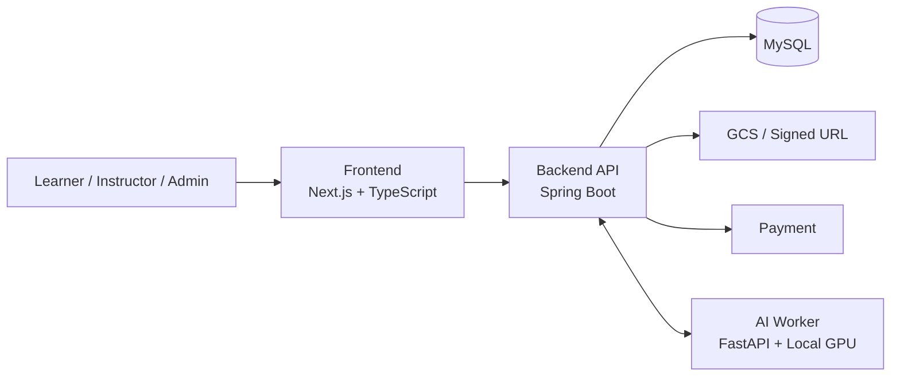
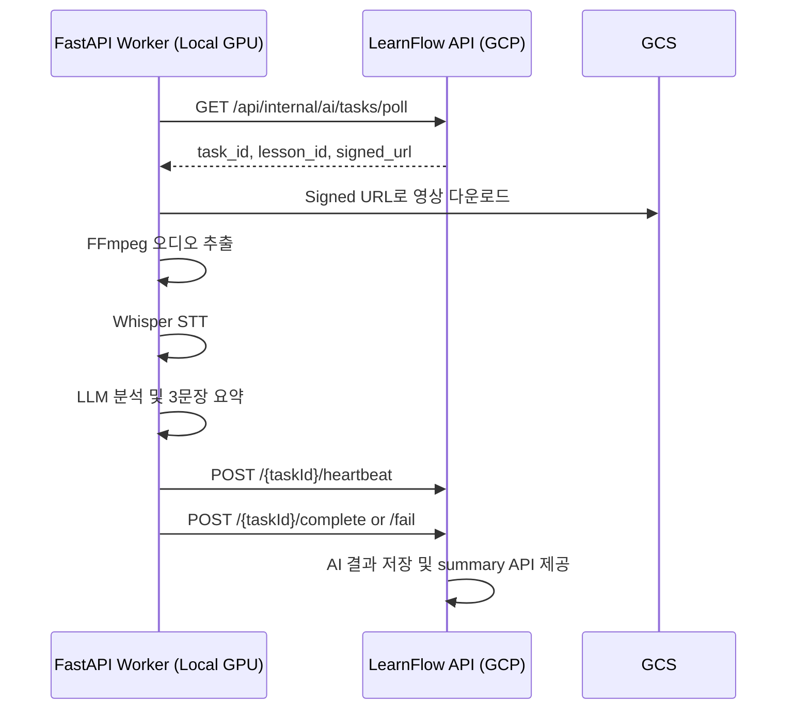

# LearnFlow API

> 사용자가 직접 강의를 등록하고 수강할 수 있는 학습 경험 플랫폼 **LearnFlow**의 백엔드 서버입니다.

이 문서는 **프로젝트 소개용 README**입니다. 개인 담당 범위, 회고, 세부 트러블슈팅은 별도 문서에서 관리하는 것을 전제로 작성했습니다.

---

## 프로젝트 개요

**LearnFlow**는 강의 제작자와 학습자를 연결하는 학습 플랫폼입니다.  
강의 생성부터 커리큘럼 구성, 영상 업로드, 관리자 승인, 결제 및 수강, 리뷰, AI 요약까지 하나의 서비스 흐름으로 연결하는 것을 목표로 했습니다.

### 이런 문제를 풀고자 했습니다

- 강의 제작자가 직접 강의를 개설하고 운영할 수 있는 구조
- 학습자가 강의를 탐색하고 결제 또는 구독 기반으로 수강할 수 있는 구조
- 관리자 화면에서 강의를 검수하고 운영할 수 있는 구조
- Lesson 단위 영상에 대해 AI 요약을 제공해 학습 경험을 보조하는 구조

---

## 프로젝트 구성

| 영역 | 설명 | 저장소 |
|---|---|---|
| Backend API | 핵심 비즈니스 도메인과 REST API | [yeyeyey3941/learnflow-api](https://github.com/yeyeyey3941/learnflow-api) |
| Frontend | 사용자/강사/관리자 UI | [team-Octave/learnflow-front](https://github.com/team-Octave/learnflow-front) |
| AI Worker | 강의 영상 요약 파이프라인 | [team-Octave/learnflow-ml](https://github.com/team-Octave/learnflow-ml) |
| Team Organization | 전체 프로젝트 리포지토리 모음 | [team-Octave](https://github.com/team-Octave) |

> 현재 백엔드 리포지토리는 팀 리포지토리(`team-Octave/learnflow-api`)를 기준으로 작업한 개인 포크 저장소입니다.

---

## 핵심 기능

### 1. 강의 생성 및 커리큘럼 구성

- 강의 생성, 수정, 삭제
- 강의 목록, 상세 조회, 내 강의 조회
- 카테고리/난이도/정렬/결제 타입 기반 필터링
- 강의 Publish 처리
- 커리큘럼 V2 기반의 **점진적 구성 방식** 지원
  - 강의 생성
  - 챕터 추가/수정/삭제
  - 레슨 추가/수정/삭제
  - 커리큘럼 바인딩 및 순서 재구성

### 2. 미디어 업로드

- 썸네일 업로드
- 영상 업로드 초기화 및 업로드 완료 처리
- Signed URL 기반 미디어 처리 흐름

### 3. 수강 경험 및 커머스

- 수강 상태 및 멤버십 상태를 고려한 레슨 접근 제어
- 결제 승인 및 결제 내역 조회
- 강의별 리뷰 조회
- 내 리뷰 조회
- 강사 답글 등록

### 4. 관리자 기능

- 승인 대기 강의 목록/상세 조회
- 승인 상태 변경
- 관리자용 강의 목록 및 상세 조회
- 삭제 강의 포함 조회 등 운영 편의 기능
- Thymeleaf 기반 관리자 페이지 제공

### 5. AI 기반 강의 요약

- 관리자 승인 흐름과 연결된 AI 요약 작업 생성
- 내부 Worker 전용 태스크 API 제공
  - `poll`
  - `complete`
  - `fail`
  - `heartbeat`
- Lesson 단위 AI 요약 조회 API 제공
- 좀비 태스크 복구용 스케줄러 운영

---

## 서비스 흐름



### 핵심 시나리오

1. 강의 제작자가 강의를 생성하고 커리큘럼을 구성합니다.  
2. 썸네일과 영상은 저장소 업로드 흐름을 통해 등록됩니다.  
3. 관리자는 승인 화면에서 강의를 검수합니다.  
4. 학습자는 목록/상세 페이지에서 강의를 탐색하고 결제 또는 구독 후 수강합니다.  
5. 승인된 Lesson 영상은 AI 요약 파이프라인과 연결되어 학습 보조 정보를 제공합니다.

---

## AI 요약 파이프라인

LearnFlow의 특징 중 하나는 **API 서버와 AI 추론 서버를 분리한 구조**입니다.

- Spring Boot API 서버는 GCP 환경에서 서비스
- AI Worker는 **로컬 GPU 환경**에서 별도 실행
- Worker가 백엔드로 직접 요청을 보내는 **폴링 방식**으로 태스크를 가져감
- 처리 중에는 heartbeat를 보내고, 완료/실패를 명시적으로 보고
- 비정상 종료로 남은 작업은 rescue worker가 복구



### AI Worker에서 담당하는 처리

- 영상 다운로드
- 오디오 추출
- STT(Whisper)
- LLM 기반 분석 및 요약
- 결과 전송 및 실패/재시도 처리

이 구조는 비용과 GPU 제약을 고려하면서도, 서비스 API와 AI 추론 파이프라인을 느슨하게 분리할 수 있다는 점에서 의미가 있습니다.

---

## 백엔드 도메인 구조

```text
src/main/java/com/teamexp/learnflowapi
├── admin
├── ai
├── auth
├── content
├── enrollment
├── global
├── lecture
├── log
├── membership
├── payment
├── review
└── user
```

### 도메인 설명

- `lecture` : 강의/챕터/레슨/커리큘럼 중심의 핵심 도메인
- `content` : 썸네일/영상 업로드 및 저장소 연동
- `payment` : 결제 승인 및 결제 이력
- `review` : 수강평 및 강사 답글
- `membership`, `enrollment` : 접근 제어와 수강 상태 관련 도메인
- `admin` : 승인 및 관리자 운영 화면
- `ai` : AI 태스크, 요약 결과, 내부 Worker 연동
- `auth`, `user`, `global` : 인증/인가, 사용자, 공통 인프라

---

## 기술 스택

| 구분 | 기술 |
|---|---|
| Backend | Java 17, Spring Boot 3.5.8, Spring Security, Spring Data JPA |
| Auth | JWT 기반 인증/인가 |
| Database | MySQL |
| Storage | Google Cloud Storage, Signed URL |
| AI | FastAPI, Python 3.12+, Whisper, FFmpeg, LLM 기반 요약 |
| Admin | Thymeleaf, Apache POI |
| Operations | Actuator, Prometheus, Zipkin, Loki |

---

## 주요 특징

### 1. 강의 커리큘럼 V2 설계

초기 일괄 생성 방식에서, 강의 생성 후 챕터와 레슨을 점진적으로 구성하는 V2 API를 도입하였습니다.  
이 방식은 프론트엔드의 편집 흐름과 더 잘 맞고, 부분 수정 및 순서 재구성에서도 필요한 변경사항이었습니다.

### 2. 미디어 처리와 API 분리

영상 파일 자체를 API 서버가 직접 받는 방식이 아니라, **업로드 초기화 → Signed URL 발급 → 업로드 완료 보고** 흐름으로 분리해 대용량 파일 처리 부담을 줄였습니다.

### 3. API 서버와 AI 서버의 역할 분리

실시간 서비스 API와 장시간 GPU 연산을 분리하면서도, polling / heartbeat / retry / zombie rescue 같은 운영 요소를 추가해 **"동작하는 데모"를 넘어 운영 가능한 구조**를 지향했습니다.

---

## 관련 문서 및 링크

- [Team Organization](https://github.com/team-Octave)
- [Frontend Repository](https://github.com/team-Octave/learnflow-front)
- [AI Worker Repository](https://github.com/team-Octave/learnflow-ml)
- [Original Team API Repository](https://github.com/team-Octave/learnflow-api)

---

## 마무리

LearnFlow는 단순한 CRUD 프로젝트가 아니라,  
**강의 등록 → 커리큘럼 구성 → 미디어 업로드 → 관리자 승인 → 결제/수강 → 리뷰 → AI 요약**까지 이어지는 흐름을 하나의 서비스 안에서 풀어보려 했던 프로젝트입니다.

특히 백엔드에서는 핵심 도메인 분리, 커리큘럼 V2 설계, 관리자 운영 기능, AI Worker 연동까지 포함해 실제 서비스에 가까운 구조를 만드는 데 집중했습니다.


### 시연 영상
1. [Learnflow 1st](https://youtu.be/NERggJIExqc)
2. [Learnflow 2nd](https://youtu.be/0gkHzKKYRfI)
3. [Learnflow 3rd](https://youtu.be/KrFDvoIzkLA)